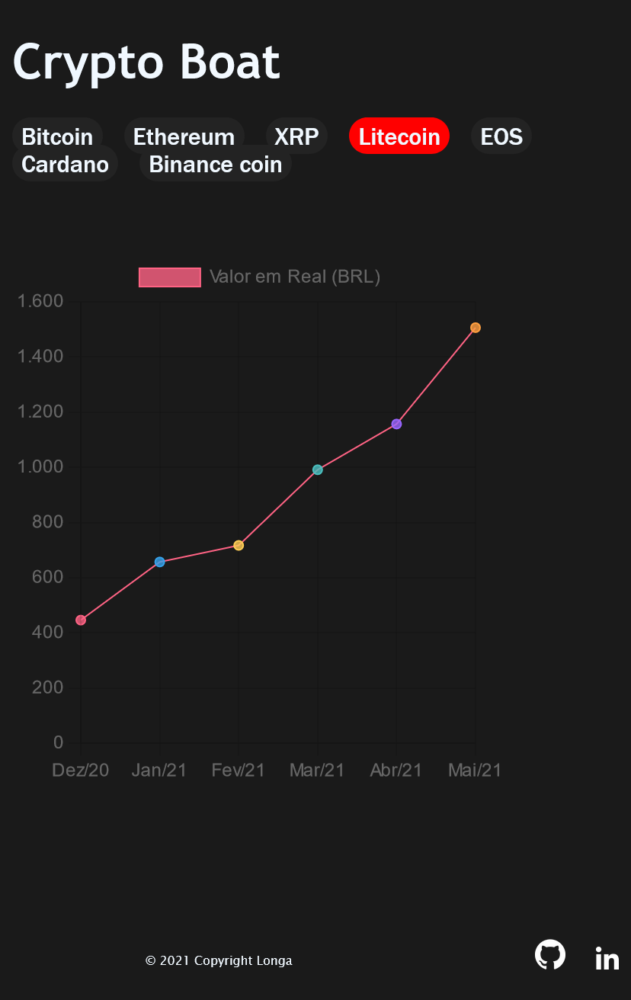
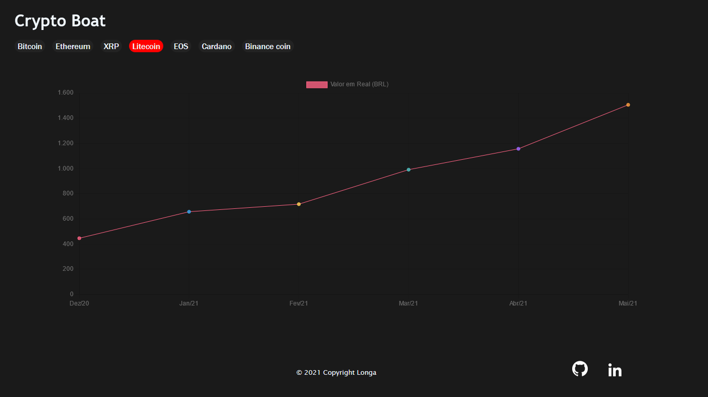

# Crypto Boat

O Crypto Boat é um site de interface simples para acompanhar a flutuação no valor de criptomoedas.

Projeto desenvolvido seguindo a prática de mobile first.

## A idéia do projeto é:

    Ser um site simples para exibição da variação do valor de criptoativos durante 6 meses.

### Interface

## Dependências

No projeto foram utilizadas as bibliotecas [flask](https://flask.palletsprojects.com/en/2.0.x/) e [chart.js](https://www.chartjs.org/), segue a instalação:

~~~bash

    $ pip install flask
    $ npm install chart.js

~~~

## Como rodar

~~~bash

    $ flask run

~~~
